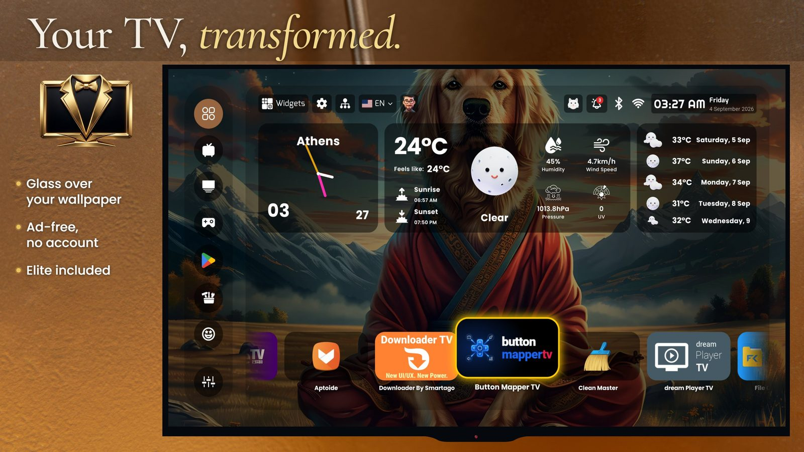
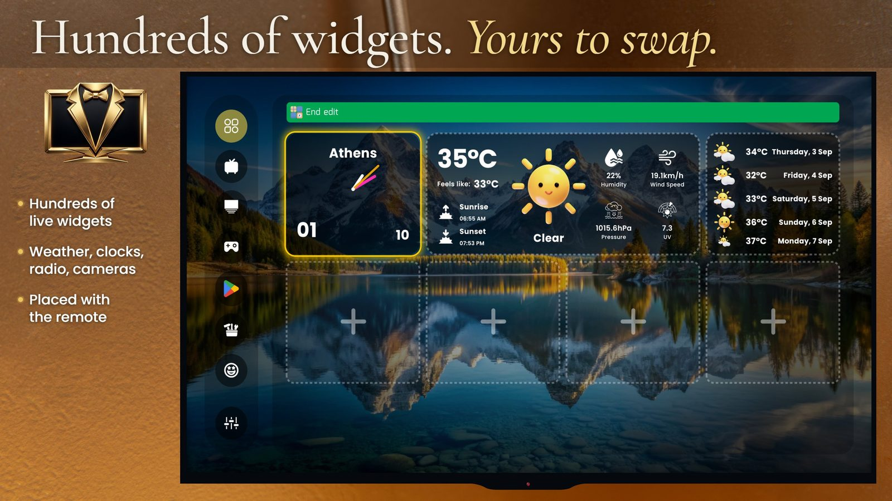
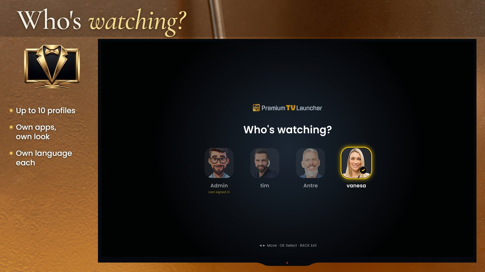
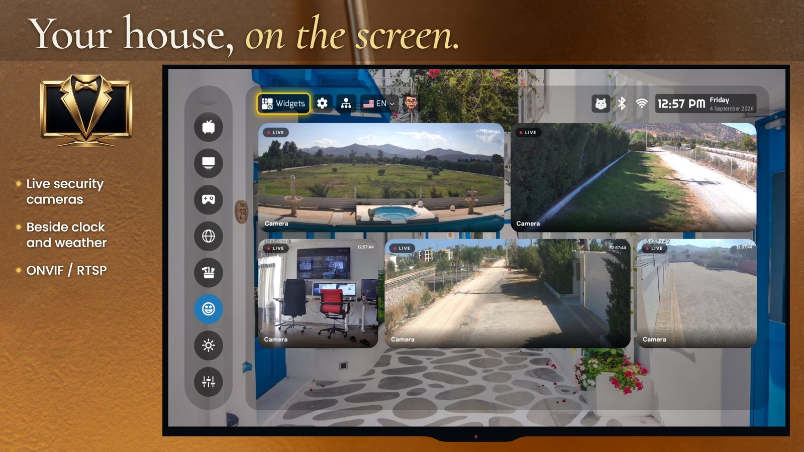
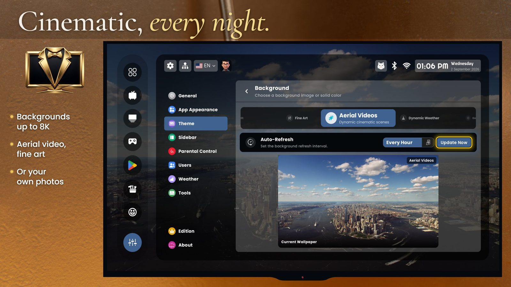
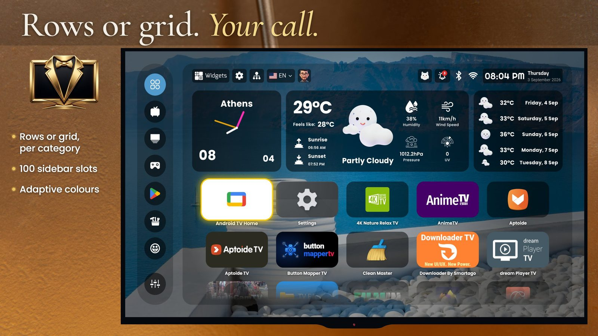
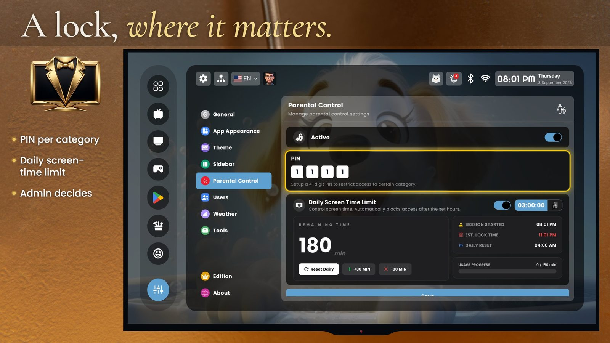

# Premium TV Launcher UI (PLUI)

**A luxury Android TV launcher — a complete home screen replacement for Android TV boxes, Google TV and Fire TV.**

No ads · no account · no subscription · the full Elite edition included at no cost

[**Get it on Google Play**](https://play.google.com/store/apps/details?id=com.premium.tv.launcher.ui) · [pluitv.com](https://pluitv.com) · [AlternativeTo](https://alternativeto.net/software/premium-tv-launcher-ui-plui-/) · [Report a bug](../../issues/new/choose)

---

## Minimal is a style. Premium is an experience.

[Projectivy](https://play.google.com/store/apps/details?id=com.spocky.projengmenu), [AT4K](https://play.google.com/store/apps/details?id=com.overdevs.at4k), [Monet](https://github.com/Klevico/Monet-Launcher), [FLauncher](https://github.com/efesser/flauncher) and Arc are excellent **minimal** TV launchers — clean grids in the Apple TV style. If minimal is what you want, they are a great choice, and we mean that.

PLUI is the other school: **a complete, luxurious living room.** Glass panels over your own wallpaper, weather drawn as art, a clock you chose, your security cameras next to the forecast, and a home screen for every member of the house.

Two philosophies, honestly stated. Pick yours.

| | Minimal launchers | **PLUI** |
|---|---|---|
| Idea | get out of the way | make the TV feel expensive |
| Home screen | app grid | glass widgets over your wallpaper |
| Widgets | few or none | hundreds — 82 weather faces, 38 clocks, radio, media, system |
| Profiles | — | up to 10, each with its own apps, theme, language |
| Parental control | — | PIN per category + daily screen-time limit |
| IP cameras | — | ONVIF / RTSP live on the home screen |
| Screensaver | — | cinematic aerial video, 8K gallery |
| Ads / sponsored rows | none | none |
| Price | free | free, Elite included |

---

## What you get

**✨ What you see first**
- Glass widgets over your own wallpaper — panels take their colour from the picture behind them
- Hundreds of live widgets: 82 weather faces, 38 clocks, 5-day forecast, radio, media, system
- Backgrounds up to 8K: curated gallery, aerial video, fine art, NASA, Reddit, or your own photos
- Cinematic screensaver with aerial video

**👨‍👩‍👧 For the whole house**
- "Who's watching?" — up to 10 profiles, 100+ avatars or your own photo
- Each person keeps their own apps, sidebar, backgrounds, theme, language and widgets
- The administrator decides what every profile may change
- Parental control: PIN per category and a daily screen-time limit

**📷 Your house on the screen**
- Live security cameras (ONVIF / RTSP) beside the clock and the weather — a viewer, not a recorder

**🎛 Made the way you want it**
- Rows or grid per category · cinematic grid · icon size and style · app names on or off
- A sidebar you build: 100 slots for categories, apps, widget pages and tools, each with its own icon and lock
- Remote shortcuts: the red button opens Cameras, Num 1 opens Games — inside the launcher
- Built-in tools: device info, network speed test, free-up-space, cloud backup with one Device ID

**🌍 45 languages** · **🔒 No ads, no tracking, nothing sold**

---

## Install

**Google Play (recommended)** — [play.google.com/store/apps/details?id=com.premium.tv.launcher.ui](https://play.google.com/store/apps/details?id=com.premium.tv.launcher.ui)

**Sideload** — for devices the Play Store marks as unsupported (many Chinese TV boxes, Fire TV). Grab the APK from [**Releases**](../../releases) and install it with [Downloader by Smartago](https://play.google.com/store/apps/details?id=com.downloader.tv.installer.xapk), Send Files to TV, or `adb install`.

Full walkthrough: [docs/install.md](docs/install.md)

**Requirements:** Android 6.0 (API 23) or newer · Android TV, Google TV, Fire TV, or any Android TV box

---

## The HOME button

The single most asked question. Making PLUI open when you press HOME on the remote works differently per device — some let you simply pick a default launcher, some do not. **Read [docs/home-button.md](docs/home-button.md)** — it covers Google TV, Fire TV, and the boxes that hard-wire the button to their own launcher.

---

## Screenshots

| | |
|---|---|
|  |  |
|  |  |
|  |  |

---

## Support

- **Something broken?** [Open an issue](../../issues/new/choose) — include your device and Android version
- **Idea?** [Feature requests](../../issues/new/choose) are read and voted on
- **Email:** support@smartago.net — a human answers within 24–48 hours
- **FAQ:** [docs/faq.md](docs/faq.md)
- **Press & reviewers:** [docs/reviewer-guide.md](docs/reviewer-guide.md) — three-minute install, the HOME button, six things to look at, known limits; press kit with screenshots and logos at https://pluitv.com/us/press/

## About this repository

This is the public home of PLUI: **official builds, documentation, changelog and issue tracker.** The launcher's source code is not published here.

Made by [Smartago](https://smartago.net). © Smartago — the app, its artwork and its name are not free to redistribute; the documentation in this repository is.
